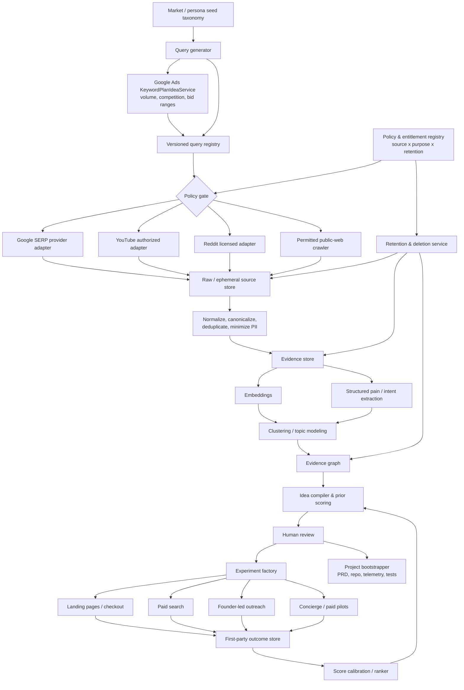
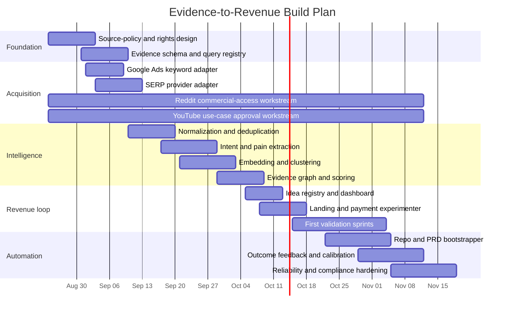

# Evidence-to-Revenue: A Rights-Aware System for Mining Search Demand, Synthesizing Product Ideas, and Rapidly Validating Willingness to Pay

> Founding design document (2026-08-21). Saved verbatim from the deep-research
> session that produced it. Citation markers removed; no other edits.

## Executive summary

The most important design conclusion is that this should **not** be built as "scrape Google + YouTube + Reddit, dump everything into an LLM, and rank ideas." As of August 20, 2026, the three sources have materially different access and reuse rules. Google's Custom Search JSON API is closed to new customers and will end for existing customers on January 1, 2027; Google also prohibits automated access that violates machine-readable instructions. YouTube explicitly prohibits scraping YouTube/Google applications, restricts aggregation of YouTube API Data, and does not provide an official mechanism for downloading arbitrary public-video captions: `captions.download` requires permission to edit the video. Reddit's current Developer Terms prohibit commercial use of Reddit Services and Data, including revenue from derived data, without a separate agreement, and separately prohibit circumventing limits and training AI/algorithmic models on Reddit data without permission.

That changes the optimal architecture. The durable asset should be a **rights-aware evidence and experimentation engine**, not a scraped corpus. Every source adapter should attach an entitlement profile specifying whether a record may be stored, aggregated, used for inference, sent to a third-party model, displayed, trained on, or retained after deletion. The system should be capable of operating profitably with any individual source disabled.

The recommended first production version is therefore:

1. Use the **Google Ads API** for official keyword expansion, monthly-search estimates, competition, and bid-range signals. `KeywordPlanIdeaService` programmatically generates keyword ideas and historical metrics, and the current API limits the major keyword-planning methods to 1 request/second per customer ID.
2. Acquire Google SERPs through a **contracted commercial SERP-data provider** with explicit contractual representations about provenance, permitted commercial use, deletion, and indemnification rather than building a rotating-proxy Google scraper. Google's legacy Custom Search API is no longer an option for new customers.
3. Treat **YouTube as approval/rights gated**. The official API can discover videos and comments, but an automated cross-channel opportunity-scoring product built from YouTube API data is not something I would classify as green-lit without platform/legal review because YouTube's developer policy expressly restricts aggregation and prohibits obtaining scraped YouTube data. Arbitrary transcript scraping should not be a production dependency.
4. Treat **Reddit commercial ingestion as disabled until a commercial agreement is obtained**. Eligible free API access currently allows 100 queries/minute per OAuth client ID averaged over ten minutes, but Reddit's current terms say commercial/business use and monetization of derived Reddit data require a separate agreement.
5. Use NLP to turn permitted evidence into structured `pain_claim` objects with explicit evidence provenance. Embeddings, UMAP/HDBSCAN clustering, and BERTopic-style topic representations are appropriate foundations; LLMs are useful for structured extraction and hypothesis generation but should never be allowed to create unsupported market evidence.
6. Separate **idea discovery from validation**. Search volume, comment frequency, sentiment, engagement, CPC and complaints are priors. A product is not "validated" until users exhibit behavior consistent with willingness to pay: paid pilots, deposits, preorders, purchases, or sufficiently strong economics in a controlled acquisition test.
7. Close the loop by storing every hypothesis, its pre-test features, and subsequent outcomes—conversion, payment, CAC, activation and retention. Over time the ranking system should learn which upstream evidence patterns actually predict revenue rather than relying permanently on handcrafted weights.
8. Productize the system initially as a **paid research/implementation service or productized agency**, then turn repeated workflows into SaaS. That yields payment evidence before spending months building generalized software. A hybrid SaaS base fee plus usage is especially natural once query/API/model costs scale with consumption; Stripe explicitly supports both usage-based and flat-plus-usage subscription structures.

The strategic moat is therefore not "we scraped more Reddit comments." It is the closed loop:

**market evidence → auditable problem hypotheses → paid experiments → observed revenue outcomes → better ranking → faster product bootstrap.**

The resulting system can bootstrap much more than ideas. For a winning hypothesis it can produce a PRD, landing-page copy, analytics schema, repository template, API contracts, test fixtures, pricing experiment, acquisition campaign draft and CRM tasks. External publishing, ad spend, outreach and source-policy changes should remain human-approved.

A useful target for a lean implementation is roughly **twelve weeks**, with one strong automation/data engineer, a part-time product/growth operator, and targeted legal review. A Google-first system can begin producing experiments earlier; Reddit and broad YouTube mining should be treated as external commercial-rights dependencies rather than schedule-critical engineering tasks.

## Architecture and compliant data acquisition

The architecture should enforce source rights before—not after—analysis. The same query may be technically retrievable from three systems while being legally usable for three different sets of purposes. That distinction belongs in code.



**The policy registry is a first-class component.** A useful row-level entitlement structure is:

```json
{
  "source": "example",
  "source_object_id": "...",
  "rights_profile": {
    "commercial_use": true,
    "aggregate": true,
    "external_model_inference": false,
    "model_training": false,
    "redisplay_raw_content": false,
    "retain_raw": false,
    "deletion_propagates": true
  },
  "fetched_at": "...",
  "retention_deadline": "...",
  "policy_version": "..."
}
```

Those booleans are populated from the actual source contract, not inferred from the fact that something is publicly visible.

### Source comparison

| Source | Research value | Recommended acquisition route | Current technical limits / capabilities | Critical rights issue | Production posture |
|---|---|---|---|---|---|
| **Google Search results** | Broad category discovery, incumbent identification, commercial SERP structure, pages ranking for pain/solution terms | Contracted SERP-data provider; legacy Custom Search only if already grandfathered | Google Custom Search is closed to new customers; existing customers have until Jan. 1, 2027. Legacy pricing is 100 queries/day free, then $5/1,000 up to 10,000/day. | Google Terms prohibit automated access that violates machine-readable instructions. | **Amber:** provider due diligence required |
| **Google keyword demand** | Search-volume proxy, competition, commercial bid signal, query expansion | Official Google Ads `KeywordPlanIdeaService` | Can generate ideas from keywords/URLs and supply historical monthly-search, competition and bid-range metrics; major keyword-planning calls are capped at 1 QPS/customer ID. | Must follow Ads API access/policy requirements | **Greenest Google path** |
| **YouTube search/metadata** | Problem demonstrations, tutorial language, categories and creators | Official YouTube Data API where proposed processing is permitted | `search.list` returns at most 50 items/request; default projects currently receive 100 `search.list` calls/day. | Developer policy prohibits scraping and substantially restricts aggregation of API Data. | **Red/amber pending approval for this use case** |
| **YouTube comments** | Questions, objections, workaround descriptions | Official `commentThreads.list`, subject to approved use | Up to 100 comment threads/result page; ordering can be time or relevance. | Same aggregation/scraping restrictions apply. | **Rights-gated** |
| **YouTube transcripts** | Extremely rich pain/workflow language | Creator-authorized captions, creator-supplied media/transcript, or demonstrably rights-cleared licensed source | Official `captions.download` costs 200 quota units and requires the authenticated user to have permission to edit the video. | YouTube prohibits scraping and downloading/storing audiovisual content without prior written approval. | **Do not depend on arbitrary public transcript scraping** |
| **Reddit** | Unusually explicit complaints, switching discussions, DIY workflows and buyer language | Official OAuth API **after applicable commercial rights are obtained** | Eligible free access: 100 QPM/OAuth client, averaged over ten minutes; unauthenticated traffic is blocked. | Business/monetized use and monetization of derived data require separate Reddit agreement; model training without permission is prohibited. | **Disabled commercially until agreement** |
| **Pages discovered through SERPs** | Pricing, competitor positioning, documentation, reviews, alternatives | Ordinary HTTP crawler only where site rules and rights permit; otherwise browser/human or licensed source | Site-specific | `robots.txt` is a crawler-control protocol, not itself authorization. | **Per-domain policy** |

### Google design

For full-web Google SERPs, avoid making a direct Google scraper your infrastructure foundation. Google's official Custom Search JSON product is unavailable to new customers and reaches end of transition for existing users on January 1, 2027. Google's general terms also specifically call out automated access that contravenes machine-readable controls.

A commercial SERP provider gives you a stable API abstraction, parsed result features and geographic targeting. It does **not automatically establish that Google has licensed the provider's collection method**, so the procurement check should ask for data provenance, compliance representations, contractual permitted uses, deletion obligations, security terms and indemnity. SerpApi, for example, currently publishes tiers from $25/month for 1,000 searches through $275/month for 30,000 searches, plus enterprise plans. DataForSEO publishes a pay-as-you-go model with a minimum account payment, while Bright Data sells SERP retrieval on successful-request models; current contract terms should be evaluated rather than assuming these services confer platform authorization.

The more valuable official Google component is often **keyword planning**, not the result pages themselves. Seed each problem/vertical with words, phrases and competitor URLs, call `GenerateKeywordIdeas`, and cache the output because keyword-planning data does not need minute-by-minute refresh. Historical metrics provide approximate monthly searches, competition and bid ranges; these are useful *commercial-demand priors*, not proof that someone will buy your specific solution.

Store SERP observations as events rather than pretending a rank is permanent:

`serp_observation(query_id, locale, device, fetched_at, rank, result_type, title, canonical_url, domain, snippet, provider_payload_ref)`

That permits time-series features such as incumbent churn, new entrants, ad density and rank persistence without overwriting history.

### YouTube design

YouTube is the hardest source in the requested design.

Technically, the Data API is useful: search can return up to 50 results, comments up to 100 threads per request, and search supports chronological/relevance ordering and time filters. But technical accessibility is not equivalent to permitted aggregation. YouTube's current developer policy says API clients must not scrape YouTube or Google applications or obtain scraped YouTube content, prohibits downloading/caching audiovisual content without prior written approval, and says API Data generally must not be aggregated except under the stated same-content-owner scenario. YouTube's ordinary Terms likewise prohibit automated service access by scrapers except for public search engines complying with robots or with prior written permission.

**My risk classification is therefore that an automated "aggregate thousands of YouTube videos/comments with Reddit and Google, derive market-opportunity scores, and commercialize those outputs" system needs YouTube-specific approval/legal analysis before production.** That is an inference from the breadth of the aggregation and scraping provisions, not a claim that YouTube has adjudicated this exact architecture.

For transcripts, the constraint is even clearer: `captions.download` requires the requesting user to have permission to edit the relevant video. A package that extracts arbitrary public YouTube transcripts through undocumented interfaces may be technically convenient, but it should not be your commercial collection path in light of YouTube's prohibition on undocumented APIs and scraping.

A safer architecture supports three YouTube modes:

| Mode | Data | Use |
|---|---|---|
| **Creator-owned** | Authorized API metadata, owned captions, creator-provided originals | Full analysis subject to the applicable YouTube API agreement |
| **Partner-licensed** | Content/transcripts provided under an explicit license with the rights required for your processing | Analyze only within those rights |
| **Discovery-only** | URLs/titles surfaced by compliant discovery paths; analyst watches relevant videos normally | Human qualitative research; no automated transcript corpus |

This means YouTube can still inform product research without becoming a brittle data dependency.

### Reddit design

Reddit's technical API is comparatively straightforward: clients authenticate through OAuth, should use an accurate descriptive user agent, and eligible free Data API users currently receive 100 queries per minute per OAuth client ID averaged over ten minutes. Reddit exposes rate state through `X-Ratelimit-*` response headers.

The commercial rights issue is decisive, however. Reddit's current Developer Terms state that, absent express permission, developers may not access/use Reddit Services and Data on behalf of a business or as part of a monetized product, and may not derive revenue from Reddit Services/Data or data derived from it. Commercial use requires a separate agreement. The same terms prohibit circumventing limits or masking usage through overlapping apps and prohibit using Reddit data to train AI or other algorithmic models without permission.

Accordingly:

**Do not build the production business assuming the free Reddit API is your commercial market-research feed. Obtain a commercial agreement first.**

Once appropriately licensed, your adapter still needs deletion synchronization. Reddit instructs API users to remove deleted content and deleted-user identifiers, says even de-identified retention of deleted content violates its policies, and recommends routinely clearing stored user data/content on a short cycle. The current Developer Terms additionally require deletion under specified conditions and permanent deletion of licensed materials when the developer agreement terminates.

That makes a **lineage-aware deletion graph** essential:

`source object → segments → extracted claims → embeddings → clusters → idea evidence`

When an upstream object becomes ineligible, the system can invalidate or rebuild dependent artifacts rather than leaving stale source-derived information indefinitely.

### Proxies, rate limiting and crawl behavior

Proxies should have a narrow legitimate role: geo-routing for explicitly permitted collection, provider redundancy, and normal outbound infrastructure. They should **not** be the mechanism for defeating rate limits, CAPTCHAs, blocks, login requirements or platform bans. Reddit expressly prohibits rate-limit circumvention and masking a single use case behind multiple applications. YouTube prohibits scraping; Google prohibits automated access in violation of machine-readable instructions.

For your own crawler of independent web domains, build:

`robots.txt` cache → host policy → token-bucket limiter → conditional GET/cache → exponential backoff → bounded retries → content-type/size limit → canonicalization.

RFC 9309 standardizes the Robots Exclusion Protocol while expressly noting that robots rules are **not** access authorization in themselves. Therefore robots compliance is a crawler control, not a substitute for reviewing applicable site terms and content rights.

## Signal extraction and idea synthesis

The NLP pipeline should transform unstructured records into **auditable evidence**, then into hypotheses. The order matters: cluster and count evidence; do not ask an LLM to "read 10,000 documents and tell me what the market wants" and then trust its implicit arithmetic.

A practical normalized model is:

```text
query
  └── source_run
        └── evidence_event
              ├── text_segment
              ├── extracted_claim
              └── embedding
                    └── cluster
                          └── problem_hypothesis
                                └── product_idea
                                      └── experiment
                                            └── outcome
```

An `evidence_event` should contain source ID, canonical URL, original query, timestamps, locale/language, raw metadata, content hash, source-rights profile and a pointer to the raw payload where retention is permitted. Avoid making usernames part of primary keys.

The central NLP artifact should be something like:

```json
{
  "claim_type": "pain",
  "persona": "finance operations manager",
  "job": "reconcile marketplace payouts",
  "obstacle": "manual reconciliation across three exports",
  "consequence": "hours of weekly work and late close",
  "current_workaround": "spreadsheet + macros",
  "urgency": 0.82,
  "commercial_intent": "solution_aware",
  "price_or_budget_signal": null,
  "incumbents": ["..."],
  "evidence_ids": ["ev_123", "ev_998"],
  "model_version": "extractor-...",
  "confidence": 0.91
}
```

The critical field is `evidence_ids`. An LLM-generated statement without traceable source evidence is brainstorming, not research.

### Semantic pipeline

A strong default implementation is:

**Normalize → deduplicate → segment → embed → reduce → cluster → characterize → extract → aggregate.**

SentenceTransformers provides straightforward sentence/document embeddings and semantic-similarity computation. UMAP is a useful dimensionality-reduction stage before density clustering, while HDBSCAN can discover clusters at varying densities and explicitly designate smaller/unmatched groups as noise. BERTopic formalizes a related pipeline using embeddings and class-based TF-IDF for interpretable topic representations.

I would use those components as tools, not as an unquestioned "topic model." Market research has important axes that generic topical similarity misses. "Salesforce is too expensive," "How do I migrate off Salesforce?" and "best Salesforce alternative for five-person team" may be semantically similar but represent different stages of buying intent.

Use a **multi-label intent taxonomy**:

| Intent family | Typical linguistic evidence | Product implication |
|---|---|---|
| Problem-aware | "how do I…", "why does…", "takes forever", "manual process" | Unsolved job/pain |
| Workaround | spreadsheet, script, Zapier chain, copy/paste, assistant doing it manually | Existing expenditure of effort |
| Solution-aware | "tool for…", "software that…", "automate…" | Category demand |
| Comparison | "X vs Y", "best alternative", "replace X" | Active evaluation |
| Transactional | price, pricing, quote, trial, buy, subscription | Stronger commercial intent |
| Switching/churn | migrate, cancel, replacement, "too expensive", "missing…" | Incumbent displacement opportunity |
| Budget/ROI | dollar amount, hours saved, headcount, contract, procurement | WTP/unit-economics evidence |
| Feature request | "wish it…", "does anyone support…", "can X…" | Potential feature opportunity |
| Anti-demand | "solved", "not worth paying", "free tool is enough" | Disconfirming evidence |

Start with deterministic patterns and weak labels, then train or prompt a multi-label classifier on a manually reviewed dataset. For a lean system, **500–2,000 labeled examples** is a reasonable engineering starting estimate rather than a claim about a universal optimum. Optimize for precision on high-intent/WTP classes: falsely labeling general discussion as transactional demand will systematically corrupt the opportunity ranker.

### Pain-point extraction should be aspect-based, not generic sentiment

Generic sentiment is weak by itself. An angry post can reveal a lucrative pain point; an enthusiastic review can mean the incumbent is already excellent. Treat sentiment as a feature attached to a specific aspect:

`incumbent + feature + polarity + severity + consequence + desired outcome`.

The economically useful features are closer to:

- obstacle severity;
- frequency of the workflow;
- cost/time consequence;
- workaround complexity;
- urgency/deadline;
- switching language;
- budget or price references;
- whether a buyer role is identifiable;
- whether the buyer is reachable through a channel;
- recurrence across independent queries/sources.

Sentiment should be low-weight context.

### Deduplication and independence

A naive counter turns viral repetition into fake demand. Deduplicate at multiple levels:

`canonical URL → exact hash → near-duplicate text → semantic duplicate → common upstream source`.

Then compute both total volume and **independent evidence volume**. Twenty articles repeating one press release are one underlying signal, not twenty buyers. Likewise, twenty comments from one discussion should not equal twenty independent searchers.

Recommended aggregate features per problem cluster include:

```text
unique_evidence_count
unique_author_or_domain_count
unique_query_count
unique_source_count
weighted_recency
high_intent_share
workaround_share
switching_share
explicit_price_signal_count
search_volume
keyword_competition
bid_range
incumbent_count
negative_incumbent_feature_count
buyer_role_consistency
channel_reachability
```

Google Ads historical keyword metrics are useful for `search_volume`, competition and bid features because the official service supplies approximate monthly searches and bid percentiles. They should not be converted into "revenue opportunity" without the downstream experiment layer.

### Temporal analysis

Create daily/weekly snapshots and maintain several windows: recent, quarter-scale and long-term. A growing problem may be more interesting than a larger shrinking one. Compute:

`velocity = recent normalized evidence rate / historical evidence rate`

along with cluster birth, persistence and recurrence. The exact decay half-life should be category-configurable; fast-moving developer tooling deserves a shorter window than accounting workflows.

Because terms and source access can change, source policy itself needs versioning. A cluster assembled under policy version `v17` needs to remain reconstructable after `v18` changes what can be retained or aggregated.

### From clusters to product hypotheses

A product hypothesis should be generated only when the system can populate:

```text
Buyer:
Job:
Pain:
Current workaround:
Current paid alternative:
Why the incumbent fails:
Evidence supporting demand:
Evidence against demand:
Acquisition channel:
Suggested product form:
Suggested pricing mechanism:
Smallest paid test:
Fastest buildable MVP:
Compliance status:
```

The generator should deliberately produce multiple forms from one pain:

`software → service → template/info product → integration → managed workflow → marketplace`.

That avoids the common failure of assuming every software-adjacent pain must become SaaS.

An example transformation:

```text
Evidence:
Operators repeatedly export data from A, clean it manually,
then reconcile against B every Monday.

Hypotheses:
1. SaaS: automatic A→B reconciliation.
2. Productized service: weekly managed reconciliation.
3. Integration: one-click sync with exception queue.
4. Template: reconciliation spreadsheet + workflow package.

Validation order:
Sell the service first → learn exceptions → automate recurring steps →
convert proven workflow into SaaS.
```

The service-first sequence is particularly attractive when the objective is *speed to payment*: it tests the outcome proposition while deferring generalized engineering.

### The closed-loop ranker

Do not permanently hard-code the scoring rubric below. At launch it is a useful prior. Once the system has dozens or hundreds of experiments, train a simple interpretable model on **first-party outcomes**:

`features_at_idea_creation → paid_within_30_days`,
`features_at_idea_creation → CAC`,
`features_at_idea_creation → retained_at_60/90_days`.

Log the feature snapshot before experimentation so there is no hindsight leakage. Evaluate with time-based holdouts and, where possible, vertical holdouts. Start with logistic regression or gradient-boosted trees before a complicated neural ranker. The objective is calibrated prediction of economic outcomes, not leaderboard accuracy.

Most importantly, do not use platform-restricted source data as model-training material where the source contract forbids it. Reddit expressly prohibits training AI/algorithmic models on Reddit Services/Data without permission.

## Validation, pricing, productization, and customer acquisition

A rigorous system should maintain two separate concepts:

**Research confidence:** "This looks like a valuable problem."

**Commercial validation:** "People take costly action—including payment—to solve it."

Mixing them creates false certainty.

### Sample research scoring rubric

Scores are 0–10 within each dimension and weighted to 100 points. The specific weights below are a recommended starting prior, not an empirical universal.

| Dimension | Weight | Evidence the system should use | What not to confuse with evidence |
|---|---:|---|---|
| Pain severity | 15 | Measurable lost time, money, errors, missed revenue, risk or operational blockage | General annoyance |
| Commercial intent | 15 | Solution/comparison/pricing/switching queries; explicit tool search | Topic popularity |
| Demand breadth | 10 | Independent observations, query diversity, historical search demand | Reposts/duplicate content |
| WTP proxy | 10 | Existing spend, budget mentions, paid workaround, paid incumbent | Likes/upvotes |
| Competitive gap | 10 | Recurring unmet requirement or poorly served segment | "There are competitors" by itself |
| Buyer reachability | 10 | Identifiable ICP plus affordable search/outbound/partner channel | Large abstract TAM |
| Repeatability / retention | 10 | Recurring workflow or continuing data/process need | One-time curiosity |
| Compliance / rights | 10 | Clear legal collection/use route | "It is public" |
| MVP speed | 5 | Paid concierge or functional wedge can be delivered quickly | Full-platform vision |
| Unit-economics potential | 5 | Plausible price relative to COGS and acquisition channel | Revenue without margin |
| **Total** | **100** |  |  |

Use **hard gates** in addition to the score. I would not advance an idea when there is no identifiable buyer, no plausible channel, no concrete test of payment, or unresolved critical source-rights risk—even if its arithmetic score looks high.

A practical triage policy could be:

`<55: archive`,
`55–69: collect more evidence`,
`70–79: interview/concierge test`,
`80+: queue for immediate paid validation`.

Those thresholds are operating defaults to calibrate from your own outcomes.

### Evidence ladder

The validation engine should rank evidence roughly by how costly the action is for the prospective customer:

| Evidence | Interpretation | Strength |
|---|---|---|
| Search/view/comment | Interest or information need | Weak |
| Email signup | Willingness to disclose contact | Weak–moderate |
| Detailed problem interview | Confirms workflow, not necessarily buying | Moderate |
| Demo request with qualifying details | Buying-process signal | Moderate |
| Scheduled pilot conversation after price shown | Stronger | Moderate–strong |
| Refundable deposit / paid discovery | Economic commitment | Strong |
| Paid concierge pilot | Direct WTP | Very strong |
| Repeated subscription/payment | Product-market evidence | Strongest stage in this pipeline |

The system should therefore optimize for **time to first paid commitment**, not time to landing-page signup.

### Competitor analysis

For each candidate idea, generate a competitor graph from permissible SERP data and then inspect competitors' official pricing/product documentation directly under the relevant site policies.

Store:

```text
competitor
category
target_persona
primary_promise
entry_price
pricing_unit
enterprise_motion
key_integrations
feature_coverage
repeated_gap_claims
switching_evidence
acquisition_position
```

Map at least three alternative classes:

`direct software`, `manual/service workaround`, `do nothing/internal process`.

The manual workaround is often the most economically important incumbent.

Google's keyword-planning API can also use seed URLs and keywords to generate related keyword ideas and historical demand metrics. Thus a competitor URL can seed a systematic "alternatives / replacement / adjacent jobs" expansion process without relying solely on an LLM's imagination.

### Pricing models

Stripe's billing documentation distinguishes flat/per-seat models from metered usage and supports combinations of a recurring base fee plus metered usage. The business-model choice should reflect how customers perceive value, not merely what Stripe can implement.

| Model | Best fit | Fast validation test | Main risk | Recommended stage |
|---|---|---|---|---|
| **Fixed SaaS subscription** | Consistent recurring workflow with similar usage | Show monthly price; collect paid trial/pilot | Heavy users can distort COGS | Early SaaS |
| **Per-seat SaaS** | Collaboration/team product where value grows with deployed users | Price a small-team package | Buyers suppress seat count | Mature B2B workflow |
| **Usage-based** | API, research jobs, compute/data-heavy automation | Pre-sell credits or meter a paid pilot | Revenue unpredictability/bill anxiety | Once usage-value link is clear |
| **Hybrid base + usage** | Intelligence/data/automation system with fixed platform value plus variable cost | Base plan plus included quota | More pricing complexity | **Strong fit for this system** |
| **Productized service** | High-value outcome that can initially be delivered manually | Fixed-scope paid pilot | Labor limits gross margin | **Best initial validation wedge** |
| **Agency/retainer** | Continuous research, implementation, demand generation | Paid 30-day sprint | Custom work can swamp product learning | Fastest path to higher-ticket revenue |
| **Info product / report / template** | Knowledge itself is primary value | Preorder report/template | Lower recurrence, easier copying | Fast low-engineering test |
| **Marketplace take rate** | Clear repeat transactions between two sides | Manually broker initial transactions | Cold-start/liquidity problem | Later, not default first wedge |

For the proposed opportunity-intelligence system itself, I would initially sell a **"research-to-paid-MVP sprint"** rather than a dashboard:

> fixed fee → discover/score opportunities → interview buyers → launch paid test → deliver one working concierge/MVP workflow.

Once the same steps repeat across customers or verticals, expose the stable primitives as software.

### Sample landing-page experiment plan

Assume, purely for illustration, a candidate B2B product priced at **$99/month**, 85% gross margin and a desired six-month CAC payback. The resulting gross-profit CAC ceiling is approximately:

`$99 × 0.85 × 6 = $504.90`.

That makes the experiment accountable to economics. If visitor-to-paid conversion were eventually 5%, the economic ceiling would be about `$25.25` per qualified paid click; at 2%, about `$10.10`. These are arithmetic examples, not recommended bids.

| Phase | Hypothesis | Treatment | Traffic | Primary KPI | Decision rule |
|---|---|---|---|---|---|
| Message test | Outcome framing beats feature framing | A: "Automate X"; B: "Recover Y hours / eliminate Z" | 50/50 randomized high-intent search traffic | Qualified CTA rate | Predeclare baseline, meaningful detectable lift and sample size before launch; no early winner from casual peeking |
| Price visibility | Buyers remain interested when a real price is shown | Same winning page with explicit `$99/mo` price | High-intent search + qualified outbound | Demo/checkout start after seeing price | Reject messaging that gets leads only when price is hidden |
| Payment test | The pain is sufficient for monetary commitment | "Start paid pilot" or genuine deposit/preorder | Same ICP | Payments / qualified sessions; CAC | Continue only when plausible CAC falls below target economics |
| Concierge test | Promised outcome can be delivered manually | Human-assisted fulfillment | Paid customers | Activation, completion, gross margin | Document every manual exception |
| MVP retention | Repeated workflow exists | Minimal automation of most repeated steps | Paid pilot cohort | Repeat usage/payment | Build deeper only when repeated behavior justifies it |

Google supports campaign experimentation infrastructure for controlled ad tests, while the Google Ads API supplies keyword and historical-demand inputs for campaign selection. For the very first smoke tests, however, your own randomized landing-page layer is often simpler because it lets you measure checkout and payment directly.

Every experiment object should contain:

```text
hypothesis
primary_metric
secondary_metrics
economics_guardrail
baseline_assumption
minimum_detectable_effect
allocation
planned_sample_size
maximum_spend
start_condition
stop_condition
result
decision
```

This prevents retrospective metric selection.

### Fast customer-acquisition playbooks

**Search-intent capture** should be the default when the research finds transactional/comparison/problem keywords. Take the ten to fifty highest-intent queries, build one page around the exact pain, show a price or paid-pilot CTA, run tightly controlled search traffic, and feed CPC/qualified-conversion/payment back to the idea record. Google's Keyword Planning API provides the search-volume, competition and historical bid context required to select these queries programmatically.

**Founder-led B2B outbound** works when the pain maps to a recognizable company role but query volume is low. Do not scrape Reddit usernames and turn personal disclosures into a sales list. Instead derive an ICP from aggregate, licensed evidence, then use lawful business-contact channels and public company-level triggers. GDPR specifically treats online identifiers as personal data and provides a right to object to direct-marketing processing; applicable jurisdictional outreach rules therefore belong in the GTM policy layer.

**Paid concierge delivery** is the fastest test for complicated automation. Sell the outcome, perform the workflow manually with internal tools, record every exception, and only automate steps that occur repeatedly. This converts customer work into requirements evidence while creating revenue.

**Integration wedge** is attractive when the evidence consistently mentions a specific incumbent. Build one narrow "X → Y" workflow rather than a general platform, acquire users searching for that exact integration/migration problem, and later expand sideways.

**Community-led acquisition** should be human and contribution-first. In particular, Reddit's current terms expressly prohibit using Reddit Services/Data for spam or harassment, making automated promotional outreach from mined Reddit data a poor fit legally and reputationally.

The fastest practical sequence is usually:

`high-intent evidence → visible price → paid concierge → repeatable workflow → narrow software → scalable acquisition`.

## Automation stack and operating model

The stack should favor Python-native components, one relational source of truth and replaceable model/provider interfaces. At early scale, there is no reason to introduce a dedicated vector database, streaming bus and large data warehouse simultaneously.

### Recommended stack

| Layer | Recommended default | Alternatives | Rationale |
|---|---|---|---|
| Source clients | Python, `httpx`, official Google/YouTube SDKs, contracted SERP API client | Provider-specific SDKs | Explicit retries, timeouts and typed adapters |
| Orchestration | **Prefect** | Dagster | Prefect supports Python-native scheduling/retries/caching/recovery; Dagster is attractive when asset lineage becomes central. |
| OLTP/evidence DB | PostgreSQL | Managed Postgres | Strong relational model for provenance, experiments and rights |
| Vector retrieval | **pgvector** | Dedicated vector DB later | pgvector keeps exact/approximate vector search alongside relational data and supports cosine and other distances. |
| Raw payloads | S3/GCS/R2-style object store with lifecycle/TTL | Local object store in development | Cheap separation of blobs from relational state; source retention policies remain enforceable |
| Local analytics | DuckDB + Polars | Pandas | Fast analyst iteration without warehouse complexity |
| Embeddings | SentenceTransformers | Hosted embedding API where contracts permit | Open/local inference is especially useful where external data sharing is constrained. |
| Topic discovery | UMAP + HDBSCAN + BERTopic | Custom clustering | Well-established semantic-topic pipeline components. |
| Structured extraction | Provider-agnostic LLM adapter + JSON Schema/Pydantic | Local model | Keeps prompts/models replaceable and auditable |
| API/UI | FastAPI + Pydantic + lightweight React/Next app | Django | Fast iteration and typed schemas |
| Internal dashboards | Metabase/Grafana-style BI | Superset | SQL-first transparency |
| Observability | **OpenTelemetry** + metrics/log backend | Vendor-specific agent | OTel is vendor-neutral and standardizes traces, metrics and logs. |
| CI/CD | GitHub Actions, pytest, Ruff, type checking, Docker | Equivalent CI | Treat data extractors like production code |
| Infrastructure | Managed Postgres initially; container workers | Kubernetes only when justified | Avoid orchestration overhead at prototype scale |

A managed bootstrap can be inexpensive. Supabase's current Pro plan starts at $25/month and includes an 8 GB database, 100 GB file storage and 250 GB egress before overage, which is sufficient for many early evidence registries. A self-hosted Postgres deployment can be cheaper but increases operational responsibility.

> **Local implementation note (2026-08-21):** this repo substitutes the hosted
> components with the workstation's loopback lanes (SearXNG :8018, text-main
> :18000, embeddings :6900) and SQLite-default storage — see
> docs/adr/ADR-0001, ADR-0003, ADR-0004. The table above records the doc's
> reference production stack.

### Pipeline jobs

A good workflow decomposition is:

```text
seed_expand
keyword_metrics_refresh
source_query_plan
source_collect
rights_validate
normalize
deduplicate
privacy_minimize
segment
embed
classify_intent
extract_pain_claims
cluster_refresh
cluster_characterize
idea_generate
idea_score
human_review_queue
experiment_generate
outcome_sync
score_calibrate
source_deletion_sync
policy_change_reprocess
```

`rights_validate` should run both before collection and before downstream use. That matters because "permitted to retrieve" does not always imply "permitted to send to an external LLM" or "permitted to aggregate across users."

Reddit's current Developer Terms, for example, say Reddit Services/Data generally may not be shared with third parties except as allowed under the terms/law. Until a commercial agreement clarifies processor/subprocessor treatment, I would conservatively route licensed Reddit data through local/self-controlled processing rather than blindly POSTing complete comment bodies to arbitrary external AI APIs.

### CI for continuous research

Treat NLP pipelines like code releases.

Every extractor or prompt change should run against:

- golden examples of pain/intent classes;
- malformed and adversarial inputs;
- duplicate/cross-post fixtures;
- deletion fixtures;
- source-policy fixtures;
- regression checks for cluster stability;
- schema migration tests;
- cost/latency budgets.

A deployment should fail when an extractor's precision on critical `transactional`, `WTP`, or `switching` labels drops below your internally specified threshold.

Persist:

`model_version`, `prompt_version`, `embedding_version`, `cluster_version`, `policy_version`, `source_adapter_version`.

That makes any score reproducible.

### Monitoring

The dashboard needs four distinct families of metrics.

| Area | Core metrics |
|---|---|
| Collection | requests, success rate, 4xx/5xx, rate-limit events, quota remaining, source latency, freshness |
| Data quality | duplicate rate, empty-text rate, language distribution, extraction failure, deletion backlog |
| Research quality | labeled precision/recall, unknown/noise fraction, cluster stability, evidence-source diversity, analyst overrides |
| Business outcomes | hypotheses/week, experiments/week, time from evidence→test, deposit rate, paid-pilot rate, CAC, activation, retention, revenue per idea |

OpenTelemetry can provide a common trace/metric/log layer across workers and API services.

The highest-level metric should eventually be something like:

`expected gross profit generated per research dollar`

rather than `documents processed`.

### Automatic product bootstrap

Once an idea passes the human gate, an "experiment compiler" can generate:

```text
/idea/{id}/
  evidence.md
  prd.md
  risks.md
  pricing.md
  acquisition.md
  experiment.yaml
  app/
  analytics/
  tests/
  deployment/
```

`evidence.md` contains only permitted evidence references and summaries. `experiment.yaml` contains the primary metric, price, spend cap and stopping rules. The bootstrapper then creates a repository from a template with:

- auth/billing skeleton if required;
- domain data model;
- minimum workflow;
- analytics events;
- error monitoring;
- feature flags;
- landing page;
- checkout/deposit integration;
- deployment config;
- acceptance tests.

The generator should optimize for **testable value**, not architectural completeness. A one-week MVP that can charge for the central workflow is preferable to automatically generating a six-month "platform."

### Team and SOP

A lean team does not need a dedicated department for every function.

| Role | Lean allocation | Accountability |
|---:|---|---|
| Product/research owner | 0.25–0.5 FTE | Ontology, evidence quality, scoring, kill/advance decisions |
| Senior automation/data engineer | 1.0 FTE | Adapters, orchestration, data model, NLP, experiment automation |
| Growth/sales operator | 0.25–0.5 FTE initially | Interviews, ads, outbound, paid-pilot closing |
| Applied NLP/data scientist | Optional 0.25–0.5 FTE after volume | Evaluation, calibration, ranking |
| Privacy/platform counsel | Targeted part-time review | Source contracts, intended processing, privacy/data-use posture |

A useful weekly operating rhythm is:

| Cadence | SOP |
|---|---|
| Continuous | Collection, rights checks, deletion sync, monitoring |
| Daily | Review failed adapters, rate limits and high-confidence emergent clusters |
| Twice weekly | Human cluster/claim audit; merge/split/label problems |
| Weekly | Score candidate ideas, select only a small number for testing |
| Weekly | Launch or conclude paid experiments |
| Weekly | Update competitor/pricing records for active candidates |
| Biweekly | Review false positives/false negatives and extractor evaluation |
| Monthly | Recalibrate weights/ranker from actual outcomes |
| Monthly | Recheck platform policies/contracts and source-retention rules |
| Quarterly | Kill stale hypotheses and review whether each data source still contributes incremental predictive value |

Three SOP rules are especially valuable.

**No evidence, no idea.** Every promoted hypothesis must have concrete evidence IDs plus disconfirming evidence.

**No score without a channel.** An apparently valuable problem with no economical way to identify/reach the buyer stays in research.

**No source without an entitlement.** Adapters default to off when rights are ambiguous.

## Legal, ethical, and platform risk

The legal problem is not simply "is web scraping legal?" There are several independent layers: platform contract, machine-readable access rules, copyright, privacy, data licenses, deletion duties and restrictions on downstream processing.

This section is technical/business risk analysis rather than jurisdiction-specific legal advice; final commercial source agreements and intended downstream uses merit counsel review.

### Risk matrix

| Risk | Severity | Why it matters | Engineering control |
|---|---|---|---|
| Reddit commercial use without agreement | **Critical** | Current terms prohibit business/monetized use and revenue from derived Reddit data absent permission. | Adapter disabled until entitlement record contains approved commercial agreement |
| YouTube arbitrary scraping | **Critical** | Developer policy prohibits directly/indirectly obtaining scraped YouTube data. | API/authorized data only; no scraper fallback |
| YouTube cross-channel aggregation | **Critical / needs review** | Current developer policy restricts aggregation of API Data. | Separate source silo; approval before automated market-score aggregation |
| Arbitrary YouTube transcript extraction | **High** | Official caption download requires edit permission; scraping/undocumented API restrictions apply. | Creator-authorized or licensed transcripts only |
| Direct Google SERP scraper | **High** | Google Terms restrict automated access contrary to machine-readable instructions; official Custom Search is closed to new users. | Contracted data provider + vendor due diligence |
| Proxy/rate-limit evasion | **High** | Reddit explicitly prohibits circumvention/masking; other platform policies prohibit scraping. | Central quotas; no rotating identities to defeat controls |
| Copyright/republication | **High** | User posts, video transcripts and pages may contain copyrighted expression; fair use is contextual, not blanket permission. | Prefer metadata/features/short evidence references; avoid redistributing corpora |
| Personal-data profiling | **High** | GDPR treats online identifiers as personal data and governs automated processing; CCPA imposes minimization/purpose constraints for covered businesses. | Pseudonymize/minimize, aggregate, retention limits, rights workflows |
| Sensitive disclosures | **High** | GDPR defines special categories including health, political, religious, biometric and sexual-life data. | Suppress sensitive-person targeting; aggregate at problem/category level |
| Deleted-source retention | **High** | Reddit requires deletion of deleted source content and related identifiers under its policies. | Source deletion watcher + lineage invalidation |
| External-LLM data sharing | **Medium–high** | Some source agreements restrict onward sharing; Reddit's Developer Terms restrict third-party sharing. | Local inference or explicitly approved processor relationship |
| False "validation" from engagement | **Commercially high** | Engagement is not payment evidence | Validation ladder culminating in paid tests |
| Platform/API change | **High operationally** | Access products, quotas and policies evolve—for example Google's Custom Search transition. | Replaceable adapters + versioned policy registry |

### Copyright

Do not use "it is publicly accessible" as a copyright analysis. The U.S. Copyright Office describes fair use as a context-dependent doctrine assessed under the statutory four factors, including purpose/character and the commercial nature of the use. Research can qualify in some circumstances, but "research" is not an automatic exemption.

Architecturally, minimize the amount of expressive source material you need:

`full content → ephemeral parsing where permitted → structured claims/features → source pointer`.

Avoid building a customer-facing product that republishes entire Reddit threads, article bodies or video transcripts unless the rights are explicit. The product should sell **your analysis, workflow and first-party outcomes**, not access to copied third-party expression.

### Privacy

Public posts can still contain personal data. GDPR explicitly defines personal data to include online identifiers, and its Article 5 principles include lawful/fair/transparent processing, data minimization and storage limitation. California's privacy regulator likewise emphasizes purpose limitation, data minimization, deletion and proportional collection/use/retention for businesses subject to the CCPA.

The privacy-minimizing architecture should therefore:

- discard usernames where they are not analytically necessary;
- not infer protected/sensitive attributes for acquisition;
- redact email/phone/address information from research text;
- store aggregate problem evidence rather than individual dossiers;
- propagate deletion;
- encrypt source data at rest;
- use short raw-content TTLs;
- separate contact acquisition from community-content research.

The FTC has also emphasized enforcement against mass-data collectors mishandling sensitive personal information, reinforcing the practical risk of collecting sensitive data simply because it can be collected.

### "Robots allowed" is not equivalent to "all uses allowed"

RFC 9309 explicitly says robots rules are not a form of access authorization. Conversely, platforms may contractually require automated systems to honor machine-readable controls—Google's Terms do exactly that.

Therefore your domain policy should independently track:

```text
automated_access_allowed
robots_allowed
api_available
commercial_use_allowed
storage_allowed
derived_analysis_allowed
model_training_allowed
redisplay_allowed
deletion_required
```

Never collapse those into one `can_scrape=true`.

## Implementation roadmap and economics

The right implementation strategy is **Google-first and experiment-first**, with YouTube and Reddit access proceeding in parallel as rights/licensing workstreams. Do not hold revenue validation hostage to platform agreements.



The Reddit and YouTube bars intentionally represent **parallel external-dependency work**, not a promise that approval will arrive within that period.

### Delivery milestones

| Milestone | Target | Deliverable | Exit criterion |
|---|---|---|---|
| Policy-safe skeleton | End week 2 | Source entitlement registry, evidence schema, retention/deletion design | No adapter can persist/process records without a rights profile |
| Google demand engine | End week 4 | Keyword expansion + historical metrics + SERP provider ingestion | Repeatable query batch produces normalized evidence |
| Intelligence engine | End week 6 | Dedupe, intent classifier, pain extraction, embeddings/clusters | Human audit finds claims traceable to evidence |
| Opportunity registry | End week 7 | Cluster dashboard, competitor map, initial scoring | Top ideas can be inspected and challenged |
| Experiment factory | End week 9 | Landing-page templates, checkout/deposit, analytics, ad/outbound drafts | One hypothesis can go evidence→paid test without custom infrastructure |
| Revenue validation | Weeks 9–11 | Several paid experiments | At least one clear advance/kill decision from behavioral evidence |
| Bootstrap engine | Weeks 10–12 | PRD/repo/tests/telemetry generator | Winning experiment can create an MVP project automatically |
| Continuous loop | End week 12 | Outcome synchronization and calibrated ranking dataset | Every experiment updates historical idea/outcome records |

### Resource estimate

For a lean implementation, I would budget approximately:

| Resource | Twelve-week planning estimate |
|---|---:|
| Senior automation/data/full-stack engineer | 12–14 engineer-weeks |
| Product/research ownership | 3–6 person-weeks |
| Growth/sales | 3–6 person-weeks, concentrated in validation phase |
| Applied ML specialist | 0–3 person-weeks; optional initially |
| Counsel/platform/privacy review | Roughly 10–30 hours initially, plus actual commercial agreement negotiation |

These are project-planning estimates, not industry benchmarks. A technically strong founder can collapse product, engineering and some research into one role. The role I would *not* eliminate is targeted rights/privacy review, because the proposed source mix has unusually consequential platform restrictions.

### Tool and infrastructure cost ranges

Current public anchor prices make a low-volume prototype inexpensive relative to labor. SerpApi currently charges $25/month for 1,000 searches, $75 for 5,000, $150 for 15,000 and $275 for 30,000. Supabase Pro starts at $25/month. Open-source components such as pgvector, SentenceTransformers, UMAP/HDBSCAN, Prefect and OpenTelemetry reduce the need for separate paid infrastructure at prototype scale.

The following are **planning ranges**, excluding engineering labor and any negotiated Reddit/YouTube commercial data rights:

| Stage | Typical workload assumption | Data + core cloud | LLM / ML compute assumption | Validation spend | Approx. cash/month excluding labor/licenses |
|---|---|---:|---:|---:|---:|
| Local proof of concept | Hundreds–1k SERPs, local NLP | $0–$75 | $0–$100 | $0–$500 | **$0–$675** |
| Lean pilot | ~5k SERPs, managed DB, weekly analysis | $100–$250 | $50–$300 | $500–$2,000 | **$650–$2,550** |
| Validation engine | ~15k–30k SERPs, continuous jobs | $250–$800 | $100–$1,000 | $2,000–$10,000 | **$2,350–$11,800** |
| Production research program | Higher/custom volume | $1k–$5k+ planning allowance | $500–$5k+ | Channel-dependent | **$1.5k–$10k+ before acquisition and data licenses** |

The ranges above intentionally do **not** estimate Reddit commercial licensing or any YouTube-specific licensing/approval arrangement, because those are contractual dependencies whose price cannot responsibly be inferred from public API limits. Reddit's published terms say commercial use requires a separate agreement.

### SERP-provider/Tool comparison

| Option | Current commercial model | Strength | Limitation |
|---|---|---|---|
| Google Custom Search JSON | Legacy only: 100 free/day then $5/1,000, max 10k/day | Official Google interface | Closed to new customers; transition required by Jan. 1, 2027. |
| SerpApi | $25/1k, $75/5k, $150/15k, $275/30k monthly tiers | Simple parsed API and predictable starter pricing | Third-party provenance/contract still needs review. |
| DataForSEO | Pay-as-you-go model, minimum account funding | Attractive for variable/batched workloads | More operational/provider-specific integration; review current contract/pricing. |
| Bright Data SERP API | Successful-request commercial model | Geo/unblocking infrastructure abstracted by provider | Contract/provenance review remains necessary. |

### Final recommended build order

The highest-return first version is narrower than the original data-collection vision:

**Phase A: Google + first-party outcomes.** Use Google Ads keyword planning, a contracted SERP source, permitted competitor pages, a structured evidence graph, human review and real landing/payment tests. Google provides programmatic keyword generation and historical demand metrics without requiring you to infer demand solely from scraped result pages.

**Phase B: revenue-generating research service.** Use the internal platform to sell a fixed-price "find and validate one valuable workflow" engagement. This generates proprietary buyer interviews, pricing objections, experiment outcomes and paid-use data—the cleanest training signal in the entire system.

**Phase C: automate what the paid service repeats.** Turn repeated research, competitor mapping, landing creation, instrumentation and project scaffolding into SaaS modules. Use a base subscription plus metered research/AI usage if variable COGS are material; this is a billing structure directly supported by standard subscription infrastructure.

**Phase D: add Reddit only under explicit commercial terms and add YouTube only for uses whose aggregation/content rights are clearly authorized.** Reddit's current terms make commercial approval a prerequisite for the requested business use, while YouTube's scraping, audiovisual-content and API-data aggregation restrictions make arbitrary transcript/comment mining a poor dependency without specific approval.

**Phase E: learn from payments.** Once enough experiments exist, gradually replace subjective research weights with a calibrated model trained on data you own and are entitled to use: which evidence profiles predicted deposits, paid pilots, CAC below threshold, activation and retention.

That final step is what turns the project from a sophisticated trend-monitoring dashboard into a repeatable company-building machine. The defensible dataset is not the copied public corpus; it is the historical mapping between **auditable market evidence and actual buyer behavior**.
